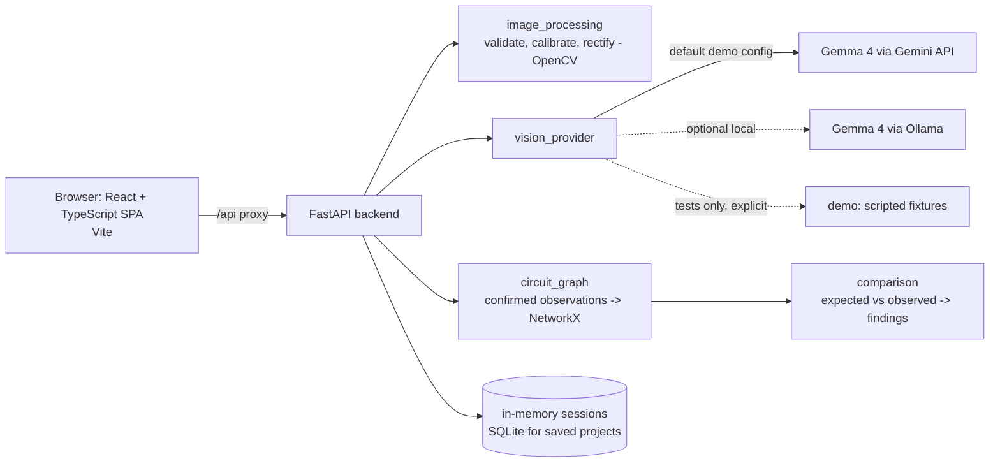

# Wirewise

> A visual inspection and learning tool that uses computer vision and Gemma 4 to compare real breadboard circuit photos against target circuit schematics.

## Team

**Team Name:** Team Vitality


| Member | Contribution   |
| ------ | -------------- |
| Aakaash Pavangat | Designed and built the Next.js App Router frontend, interactive Canvas/SVG image annotation tools, breadboard calibration handle controls, and the visual findings report UI.|
| Tanala Phanendra | Integrated the Gemma 4 vision model API, engineered structured prompts for candidate component/wire extraction, architected the server-side provider adapter, and created the offline demo provider fallback.|
| Mohammad Liyakat Ali | Developed the OpenCV image processing pipeline, implemented the 4-point perspective warp transformation algorithms, and mapped physical photo coordinates to breadboard pin grids. |
| Govind Shrundan Reddy | Architected the FastAPI backend server, built the NetworkX deterministic graph comparison engine, defined the Pydantic data models, and implemented the catalog rules validator. |


## Problem Statement

### The Problem

Electronics hobbyists, students, and educators working with solderless breadboards frequently run into small, hard-to-spot wiring errors. Miscounting a breadboard row by a single pin, placing a component across the wrong power rail, or inserting a polarized diode backward can cause a circuit to fail silently or behave unpredictably.

Tracing physical circuits manually against a schematic is time-consuming and error-prone, especially for beginners. While modern software development relies on automated visual diffs and linters to catch mistakes instantly, physical prototyping lacks a reliable way to compare an assembled physical circuit against an intended wiring plan. Traditional computer vision struggles with the complex angles and overlapping wires of real-world breadboards, while raw AI vision models risk hallucinating connections or making unverified safety assumptions if relied on blindly.

### Why We Chose This Problem

Hardware debugging remains one of the steepest learning curves in STEM education and maker environments. Misplaced wires often lead to hours of unnecessary troubleshooting, student frustration, and abandoned projects.

We selected this problem to demonstrate how open-weight vision models like Gemma 4 can be combined with deterministic graph logic to solve a genuine physical-world friction point. By keeping the AI focused on visual proposal and using deterministic graph algorithms for the actual circuit comparison, we create a reliable, visual linter for physical hardware that accelerates learning without compromising safety.


## Solution Overview

Wirewise is a web-based visual inspection and learning application that compares a photograph of a physical, low-voltage breadboard circuit against a verified schematic template.

### Core Workflow

Wirewise guides users through a structured, human-in-the-loop inspection process:

1. **Interactive Calibration**  
   Upload a top-down photo of your breadboard and align key grid landmarks to correct perspective distortion using OpenCV.

2. **AI-Assisted Vision Proposals**  
   Gemma 4 analyzes the calibrated image to propose candidate components, wire endpoints, labels, and visible orientation with confidence scores.

3. **Human Verification**  
   Confirm, reject, or adjust the proposed observations. No uncertain model guess is ever silently accepted as a confirmed connection without user approval.

4. **Deterministic Graph Comparison**  
   Confirmed observations are compiled into an electrical connection graph and evaluated against the target template using NetworkX graph matching.

5. **Evidence-Based Reporting**  
   Wirewise overlays findings—such as missing wires, misplaced rows, or polarity errors—directly onto the original photo with clear explanations and pinpointed image regions.


### Key Features

* **Interactive Perspective & Grid Calibration**  
  Uses OpenCV 4-point landmark alignment to correct lens distortion and map physical breadboard coordinates directly onto top-down circuit photos.

* **Gemma 4 AI Vision Proposals**  
  Leverages Gemma 4 multimodal vision to identify component types, pin markings, wire endpoints, and polarity orientation with confidence scores and bounding polygons.

* **Human-in-the-Loop Verification System**  
  Provides an interactive review interface that requires explicit user confirmation or correction before turning visual detections into electrical connections.

* **Deterministic Graph Engine & Evidence Overlay**  
  Compiles verified connections into NetworkX graphs to evaluate expected vs. observed wiring, overlaying color-coded findings directly onto photo regions with plain-language explanations.
## Innovation and Differentiation

Wirewise introduces a novel approach to physical hardware inspection by bridging computer vision, open-weight multimodal AI, and deterministic graph theory. Unlike conventional hardware debugging tools or pure AI vision demonstrations, Wirewise differs key ways:

### 1. Hybrid Perception-Logic Architecture
Traditional AI applications often try to perform both visual recognition and safety reasoning inside a single large language model—a method prone to dangerous hallucinations and unverified electrical claims. Wirewise strictly separates these concerns:
* **Gemma 4** handles **visual perception** (proposing candidate components, labels, and wire endpoints).
* **NetworkX** handles **electrical reasoning** (deterministically evaluating the graph topology against verified catalog rules).

### 2. Geometric & Spatial Breadboard Grounding
Standard computer vision models output loose bounding boxes that fail to capture spatial precision on dense breadboard grids. Wirewise combines OpenCV 4-point perspective warp matrices with Gemma 4's visual observations, mapping 2D pixel coordinates directly onto physical breadboard row-and-column locations (e.g., mapping a wire tip to hole `a12` of the calibrated grid).

### 3. Human-in-the-Loop Verification Safeguard
Existing automated inspection systems either require expensive industrial hardware or operate as black boxes with no human intervention. Wirewise enforces a strict human-in-the-loop workflow: model proposals remain unconfirmed candidates until explicitly validated or corrected by the user, ensuring an uncertain AI guess is never silently converted into an electrical fact.

### 4. Evidence-Based "Visual Linter" for Hardware
Software developers rely on continuous integration tools and visual diffs to catch bugs early, but physical breadboard prototyping has lacked an equivalent visual tool. Wirewise acts as a visual linter for physical electronics, highlighting exact discrepancy regions directly on top of the original photo with clear, actionable explanations linked to template rules.

## Technical Implementation

### Architecture



### Technology Stack

| Category        | Technologies |
| --------------- | ------------ |
| Frontend        | React 19, TypeScript, Vite (single-page app, no server-side rendering), SVG overlays, plain CSS |
| Backend         | Python, FastAPI, Pydantic, OpenCV, NetworkX |
| Database        | SQLite (explicitly saved projects); in-memory session store for photos |
| AI / ML         | Gemma 4 (`gemma-4-31b-it`, `gemma-4-26b-a4b-it` hosted; `gemma4:e4b` local via Ollama) |
| Infrastructure  | N/A (runs locally; no deployment) |
| APIs / Services | Gemini API (hosts Gemma 4 for the default demo configuration); Ollama (optional local runtime) |

### How It Works

1. **Choose a circuit.** One verified template ships: Arduino UNO R3 pin D9, a 220 Ω resistor and a red 5 mm LED to GND, on a half-size 400-point breadboard. Parts and pinouts come from a sourced catalog (`backend/data/catalog/parts.json`), never from model memory.
2. **Calibrate.** The user places the four corner holes `a1`, `a30`, `j30`, `j1`. OpenCV computes the perspective transform and a hole grid, then checks the grid really lands on holes; if not, the user is asked to adjust.
3. **Propose.** The server sends one annotated image to Gemma 4, which proposes components, wires, colour bands, polarity cues and rough positions. OpenCV snaps those positions to the calibrated grid. Every proposal records the model name and runtime and starts as `proposed`.
4. **Confirm.** The user confirms, rejects or corrects each proposal.
5. **Compare.** Confirmed observations become a NetworkX graph (with provenance on every node and edge) that is compared with the template. No model is involved in the verdict.
6. **Report.** The result is `MATCHES TEMPLATE`, `POSSIBLE MISMATCH`, `NEEDS REVIEW` or `NOT CHECKED`, with evidence overlaid on the photo and a link to the template rule used.

### Technical Decisions

- **Explicit provider, no fallback.** `VISION_PROVIDER` is `gemini`, `ollama` or `demo`. The earlier `auto` mode silently fell back to scripted data; it was removed. A failing provider produces an error with setup steps.
- **Model proposes, code decides.** Keeps hallucinations out of the verdict and makes findings testable (85 backend tests).
- **Coarse model positions + OpenCV snapping.** Gemma 4 is not trusted for pixel-exact endpoints.
- **Untrusted model output.** Parsed leniently, length-limited, and text visible in an image is never obeyed.
- **Provenance and wording.** Each item records its source (Gemma 4, OpenCV, catalog, user); results say "confirmed connections match this template", never that a circuit is safe.
- **Vite SPA.** The earlier Next.js frontend was replaced by a Vite single-page app: no SSR is needed and the `/api` dev proxy keeps keys and backend URLs out of browser code.

More detail: [docs/ARCHITECTURE.md](docs/ARCHITECTURE.md). How Gemma 4 was assessed: [docs/GEMMA_PROOF.md](docs/GEMMA_PROOF.md).

### How Gemma 4 Contributes

Gemma 4 identifies component types (resistors, LEDs, jumper wires, the Arduino), reads printed labels and resistor colour bands, reports polarity cues where visible, gives coarse locations of wire ends and lead entry points, and flags hidden or too-blurry regions. It does **not** make the pass/fail decision, supply exact positions, or supply ratings and pinouts.

Real Gemma 4 responses to the synthetic demo images are saved in [`docs/gemma_sample_response.json`](docs/gemma_sample_response.json) (31B, corrected image) and [`docs/gemma_sample_response_26b_seeded.json`](docs/gemma_sample_response_26b_seeded.json) (26B, seeded image). In testing, Gemma found every part and wire and the seeded row-16 mistake, but called an orange decoy disc an LED, and the 26B model misread the resistor colour bands.

## Implementation During the Hackathon

The repository started from an earlier build of Wirewise (FastAPI backend with catalog, circuit graph, comparison, image processing, storage and tests, plus a Next.js frontend). *(Team: confirm which parts predate the Hack Day.)* Work recorded during the Hack Day working session in the git history:

- Replaced the Next.js frontend with a React + TypeScript + Vite single-page app, porting the existing components.
- Added the local Gemma 4 provider (Ollama), kept the hosted Gemini provider, removed the silent `auto` fallback to demo data, and made the provider an explicit server-side setting.
- Added `/api/health` and a header status with provider, model and runtime; added error and "Gemma unavailable" states with setup steps.
- Recorded model name and runtime on every observation.
- Labelled the bundled images as synthetic demo images; added tests for no-silent-fallback, health, uploads of arbitrary and blurry images (85 backend tests in total).
- Ran real hosted Gemma 4 on the synthetic demo images, saved real responses, and wrote the assessment in [docs/GEMMA_PROOF.md](docs/GEMMA_PROOF.md).
- Wrote the demo script, status document and documentation.

### Team Contributions

See the **Team** table at the top of this README.

## Working Application

**Live Application:** [Live URL]

[Briefly explain how the deployed application can be accessed and what functionality can be tested.]

The submitted application should be functional and accessible through the provided link where applicable.

## Demo Video

**Demo Video:** [Video URL]

[Provide a short demonstration of the working project, covering the main user flow and important functionality.]

## Open Source and AI Usage

### AI / Models

- **Gemma 4 `gemma-4-31b-it` and `gemma-4-26b-a4b-it` (Google DeepMind), hosted via the Gemini API:** reads the breadboard image and proposes components, wires, colour bands and rough positions. Never decides pass/fail. Gemma 4 is released under Apache-2.0 according to Google's release; check the model card for current terms.
- **Gemma 4 `gemma4:e4b` via [Ollama](https://ollama.com) (optional local path):** the same role, run on the user's machine. Ollama is MIT-licensed. Tested only with a mocked server, not with a real local model.

### Open Source Components

- **FastAPI (MIT), Uvicorn (BSD-3), Pydantic (MIT), python-multipart (Apache-2.0):** backend API and schemas.
- **OpenCV `opencv-python-headless` (Apache-2.0), NumPy (BSD-3), Pillow (HPND):** calibration, perspective correction, image validation.
- **NetworkX (BSD-3):** deterministic graph comparison.
- **httpx (BSD-3), `google-genai` (Apache-2.0):** talking to Ollama and the Gemini API.
- **React (MIT), Vite and `@vitejs/plugin-react` (MIT), TypeScript (Apache-2.0):** frontend.
- **pytest (MIT):** tests.
- **Fontsource packages for Bricolage Grotesque and Atkinson Hyperlegible Next (SIL OFL fonts):** typography.
- **Data:** the parts catalog lists a source per part (for example the Arduino UNO R3 datasheet and the IEC 60062 colour code). No datasets are used. The synthetic demo images are generated by `backend/scripts/generate_fixtures.py`.

Licenses above are stated from general knowledge of these projects; check each package for its current terms.

## Setup and Usage

### Prerequisites

- Python 3.11+ and Node.js 20.19+ (or 22.12+)
- A Gemini API key for the hosted Gemma 4 path (https://aistudio.google.com/apikey), or [Ollama](https://ollama.com/download) for the local path

### Installation

```bash
git clone <repository-url>
cd wirewise
cp .env.example .env              # then paste your key after GEMINI_API_KEY=

cd backend
python -m venv .venv
.venv\Scripts\activate           # Windows;  macOS/Linux: source .venv/bin/activate
pip install -r requirements.txt
cd ../frontend
npm install
```

### Environment Variables

Defined in `.env.example` (copy to `.env`; `.env` is git-ignored and the key never reaches the browser).

| Variable | Purpose |
| --- | --- |
| `VISION_PROVIDER` | `gemini` (hosted Gemma 4, set in `.env.example`), `ollama` (local Gemma 4), or `demo` (tests only). `auto` is rejected. Server default if unset: `ollama`. |
| `GEMINI_API_KEY`, `GEMINI_MODEL` | Hosted path. Models: `gemma-4-31b-it` (default), `gemma-4-26b-a4b-it`. |
| `OLLAMA_HOST`, `OLLAMA_MODEL`, `OLLAMA_KEEP_ALIVE` | Local path. Default model `gemma4:e4b`. |
| `GEMMA_TIMEOUT_SECONDS` | Per-analysis timeout. Server default 60; `.env.example` uses 180 (hosted 31B took 56-62 s per image). |
| `MAX_UPLOAD_MB`, `SESSION_TTL_MINUTES`, `WIREWISE_DB_PATH`, `WIREWISE_SAVED_DIR`, `CORS_ORIGINS` | Uploads, sessions, storage, CORS. |

### Running the Project

```bash
# terminal 1
cd backend && uvicorn app.main:app --port 8000
# terminal 2
cd frontend && npm run dev          # http://localhost:5173 (proxies /api to the backend)
```

Production build: `npm run build && npm run preview`. Tests: `cd backend && pip install -r requirements-dev.txt && pytest`.

### Usage

Follow [docs/DEMO_SCRIPT.md](docs/DEMO_SCRIPT.md): start from a bundled **synthetic demo image** (computer-generated, not a real photo) or upload any JPEG, PNG or WebP (at least 320 px per side), place the four corner handles, click **Check the grid**, then **Find parts and wires**, confirm or correct each proposal, and click **Check against the template**.

The header shows the provider (for example `gemini`), the model name and where it runs (`hosted via Gemini API`), and whether it is usable; the same data is at `GET /api/health`. If the key is missing or rejected, Ollama is not running, the model is not installed, or a request times out, the app shows an error with setup steps and analyzes nothing. Neither `gemini` nor `ollama` ever switches to another provider or to demo data. The hosted API is sometimes overloaded (HTTP 500/503/504 were frequent for `gemma-4-31b-it` in testing); the app reports it and you press the button again. Nothing is retried automatically.

`demo` is for tests only: scripted answers for the synthetic demo images, a persistent "DEMO MODE: no model is analyzing this image" banner, and every observation labelled demo data. It is enabled only by `VISION_PROVIDER=demo`.

### Optional: local Gemma 4 with Ollama

```bash
ollama pull gemma4:e4b        # about 9.6 GB download; roughly 10 GB of free RAM
```

Set `VISION_PROVIDER=ollama` in `.env` and restart the backend. The tag was checked against the [Ollama library page](https://ollama.com/library/gemma4) on 2026-10-08. On a machine without a GPU the first analysis loads the model and can be slow; raise `GEMMA_TIMEOUT_SECONDS` if it times out.

### Supported Hardware

| Item | Supported |
| --- | --- |
| Circuit | `uno_d9_led_220r`: D9 → 220 Ω resistor → red LED anode, LED cathode → GND |
| Board | Arduino UNO R3 (header pins D8, D9, D10, GND, 5V, 3V3 in the catalog) |
| Breadboard | Half-size 400-point, 30 rows, columns a-e and f-j, centre channel isolates |
| Parts | 220 Ω resistor (red-red-brown), 5 mm red LED, jumper wire |

Wirewise compares nets, not exact rows, so any electrically equivalent layout passes. Only low-voltage, allowlisted circuits are supported; mains voltage, household wiring, high-energy batteries and high-current motor circuits are out of scope.

### Limitations

- Tested on synthetic fixtures; accuracy on real breadboard photos has not been validated.
- One circuit, one breadboard model. Photos of other circuits or breadboards are not supported and will not calibrate or compare meaningfully.
- Power rails are not modelled; anything depending on them is `NOT CHECKED`.
- Wirewise only sees what is visible and confirmed. Hidden or out-of-frame wiring, damaged parts, bad contacts, voltages and currents are not checked, and catalog data could itself be wrong.
- Calibration is manual and needs a roughly top-down photo of the whole board with the four corner holes visible. Glare, blur, low resolution or a cropped board can fail the grid check.
- Gemma 4 makes mistakes (a decoy object called an LED, misread resistor bands, run-to-run differences), which is why every proposal needs your confirmation.
- `MATCHES TEMPLATE` means the visible, confirmed connections match the template. It is not a safety statement. Wirewise never controls hardware or sends commands to a board.

### Verification

[docs/STATUS.md](docs/STATUS.md) states exactly what was run and what was not. In short: 85 backend tests pass; the frontend builds; real hosted Gemma 4 31B was run through the UI on both synthetic demo images (seeded image: `POSSIBLE MISMATCH` on the row-16 ground wire; corrected image: `MATCHES TEMPLATE` after the decoy LED is rejected). The local Ollama path is tested only with a mock.

## Challenges and Learnings

- **Hosted model reliability and latency.** `gemma-4-31b-it` took 56-62 s per image and was often overloaded (HTTP 500/503/504), exceeding the 60 s default timeout. We raised the hosted timeout to 180 s, report overload clearly, and kept the "no automatic retry" rule.
- **Model errors are real.** Gemma 4 called a decoy object an LED and, in the 26B model, misread resistor bands; answers also varied between runs at temperature 0. This is the reason for the propose-confirm-compare design.
- **A silent fallback is a lie.** The earlier `auto` mode fell back to scripted data when no key was set. Making the provider explicit and failing loudly was the most important behaviour change.
- **Local inference is heavy.** The development machine had 15.7 GB RAM and no GPU, so a local Gemma 4 download alone took many hours; the local path is documented but unverified with a real model.
- **Inputs outside the supported hardware.** A set of ten sample circuit images (LED, buttons, sensors, 7-segment, transistor) was too small (307 px wide) and showed other circuits and breadboard layouts, so Wirewise rejects or cannot calibrate them. Refusing is the intended behaviour.

## Devpost Submission

**Devpost Project:** [Devpost Project URL]

[Add the link to the team's Devpost submission. Ensure the Devpost project page is complete and contains the required project information, links, media, and team details.]

## Credits and License

### Credits

Gemma 4 by Google DeepMind; the Gemini API; Ollama; the open-source libraries listed under Open Source and AI Usage. Team: see the Team table above.

### License

Apache-2.0. See [LICENSE](LICENSE).

Wirewise does not submit anything to MLH or OrganizerHQ; submit the repository yourself.

## Submission Checklist

- [ ] Project title and description added
- [ ] All team members listed
- [ ] Problem clearly explained
- [ ] Reason for choosing the problem explained
- [ ] Solution and key features documented
- [ ] Innovation and differentiation explained
- [ ] Architecture included
- [ ] Technical implementation documented
- [ ] Work completed during the hackathon documented
- [ ] Team contributions documented
- [ ] Working application is functional
- [ ] Live application link added where applicable
- [ ] Demo video added
- [ ] AI and open-source components documented
- [ ] Setup and usage instructions tested
- [ ] Challenges and learnings documented
- [ ] Devpost submission completed
- [ ] Devpost link added
- [ ] Credits added
- [ ] License added
- [ ] Repository is organized and complete
