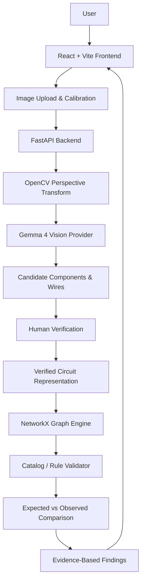

# Wirewise

> **AI-assisted visual inspection and learning for physical breadboard circuits.**

Wirewise is a web-based visual inspection tool that compares a photograph of a real, low-voltage breadboard circuit against a verified target circuit and identifies wiring discrepancies.

It combines **computer vision, multimodal AI, geometric calibration, deterministic graph comparison, and human verification** to make physical circuit debugging faster, clearer, and safer for students, educators, hobbyists, and makers.

---

## Hack Day Project

**Event:** Hacktoberfest Hack Day  Coimbatore
**Team:** Team Vitality
**Project:** Wirewise
**License:** Apache-2.0

---

#  Team

| Member | Contribution |
|---|---|
| **Aakaash Pavangat** | Designed and built the React/Vite frontend, interactive Canvas/SVG image annotation tools, breadboard calibration controls, and visual findings report interface. |
| **Tanala Phanendra** | Integrated the Gemma 4 vision model API, engineered structured prompts for component and wire extraction, designed the server-side vision provider adapter, and implemented the offline demo provider. |
| **Mohammad Liyakat Ali** | Developed the OpenCV image-processing pipeline, implemented four-point perspective transformation, and mapped physical image coordinates to breadboard pin/grid locations. |
| **Govind Shrundan Reddy** | Architected the FastAPI backend, implemented the NetworkX deterministic graph comparison engine, defined Pydantic data models, and implemented catalog-rule validation. |

---

#  Problem Statement

Working with solderless breadboards is one of the easiest ways to learn electronics, but debugging a physical circuit can quickly become frustrating.

A single misplaced wire, incorrect breadboard row, component connected to the wrong power rail, or reversed polarized component can prevent an otherwise correct circuit from working.

The problem becomes especially difficult for beginners because the physical circuit must be manually compared with a schematic or reference diagram.

Common problems include:

- Wires connected to the wrong breadboard row.
- Components placed across incorrect rows.
- Missing or extra connections.
- Incorrect power-rail connections.
- Incorrect component orientation.
- Difficulty identifying the exact location of a wiring mistake.
- Time-consuming manual debugging.

Traditional computer-vision systems also struggle with real breadboards because of perspective distortion, overlapping wires, dense grids, lighting differences, and visually similar components.

Pure AI vision systems introduce another problem: **a model can propose a connection that looks plausible but is electrically incorrect.**

Wirewise addresses both problems by separating **visual perception** from **electrical reasoning**.

---

#  Why We Chose This Problem

Hardware debugging remains a major learning barrier in electronics education and maker environments.

Students can understand the schematic correctly and still spend significant amounts of time searching for a single misplaced wire.

Software developers already have tools such as linters, visual diffs, and automated testing that help locate mistakes. Physical electronics does not have an equivalent workflow that can directly inspect the real-world implementation.

We therefore explored the idea of a **"visual linter for physical electronics."**

The key idea is to combine:

> **AI for perception + computer vision for spatial grounding + deterministic graph logic for verification + humans for final confirmation.**

---

#  Solution Overview

Wirewise allows a user to upload a photograph of a physical breadboard and compare it against a target circuit.

The system follows a human-in-the-loop workflow:

```text
                
                  Target Circuit     
                  / Template         
                
                           
                           
    
 Breadboard    Image Calibration
 Photograph            OpenCV       
    
                             
                             
                   
                    Gemma 4 Vision   
                    AI Proposals     
                   
                            
                            
                   
                    Human Verification
                    Confirm / Edit   
                   
                            
                            
                   
                    Circuit Graph    
                    NetworkX         
                   
                            
                            
                   
                    Rule Validation  
                    + Graph Compare  
                   
                            
                            
                   
                    Visual Findings  
                    & Explanation    
                   
```

---

#  Core Workflow

### 1.  Upload
The user uploads a photograph of the physical breadboard circuit.

Wirewise is designed around low-voltage breadboard circuits and is intended as an educational inspection tool rather than a replacement for electrical safety procedures.

### 2.  Interactive Calibration
The user identifies important breadboard landmarks.

Wirewise uses OpenCV's four-point perspective transformation to compensate for camera angle and perspective distortion.

### 3.  AI-Assisted Vision
Gemma 4 analyzes the calibrated image and proposes observations such as:

- Component type
- Component position
- Wire endpoints
- Wire regions
- Labels
- Visible polarity/orientation
- Confidence scores
- Image regions associated with observations

The model provides **proposals**, not final electrical truth.

### 4.  Human Verification
The user can:

- Accept an observation.
- Reject an observation.
- Correct an observation.
- Adjust its position.
- Review uncertain detections.

### 5.  Graph Construction
Confirmed observations are converted into an electrical connection graph.

Breadboard positions and components become graph entities, while confirmed connections become graph relationships.

### 6.  Deterministic Comparison
NetworkX is used to compare the observed circuit graph against the expected target graph.

This allows Wirewise to identify discrepancies such as:

- Missing connections
- Extra connections
- Incorrect rows
- Incorrect rails
- Incorrect component placement
- Potential polarity/orientation issues

### 7.  Evidence-Based Report
The result is presented visually on top of the original image.

Instead of simply saying:

> "Circuit incorrect."

Wirewise attempts to answer:

> **What is wrong, where is it wrong, and what should be checked?**

---

#  Key Features

##  Interactive Perspective & Grid Calibration

Uses OpenCV four-point perspective transformation to reduce the effect of camera perspective and map image coordinates to physical breadboard locations.

##  Gemma 4 Vision Proposals

Gemma 4 is used for multimodal visual analysis and proposes:

- Components
- Wire endpoints
- Labels
- Orientation
- Candidate connections
- Confidence information

##  Human-in-the-Loop Verification

AI detections are not automatically treated as confirmed electrical facts.

Users explicitly verify observations before they enter the circuit-comparison stage.

##  Deterministic Graph Comparison

Verified observations are represented as a graph and compared against the expected circuit topology using NetworkX.

##  Evidence-Based Visual Findings

Detected discrepancies are associated with image regions so users can understand where the problem occurs.

---

#  Innovation & Differentiation

## 1. Hybrid PerceptionLogic Architecture

Wirewise does not ask a single AI model to both understand an image and make unrestricted electrical decisions.

| Layer | Responsibility |
|---|---|
| **Gemma 4** | Visual perception and candidate observations |
| **OpenCV** | Geometric calibration and spatial mapping |
| **Human** | Verification and correction |
| **NetworkX** | Deterministic graph comparison |
| **Catalog Rules** | Component/circuit validation |
| **Wirewise UI** | Evidence and explanation |

---

## 2. Geometric Breadboard Grounding

A normal object detector might identify a wire using a bounding box.

That is not enough for a breadboard.

A difference of only one row can completely change the circuit.

Wirewise therefore combines visual detection with geometric calibration so image coordinates can be associated with physical breadboard locations.

```text
Image coordinate
       
Perspective transformation
       
Breadboard coordinate
       
Row / Column / Rail
       
Circuit connection
```

---

## 3. Human-in-the-Loop Safety Mechanism

AI predictions remain candidates until a user verifies them.

This design intentionally avoids silently converting uncertain visual predictions into electrical facts.

---

## 4. Visual Linter for Hardware

Software has linters.

Hardware prototyping generally does not have an equivalent visual debugging workflow.

Wirewise explores the idea of applying the same philosophy to physical electronics:

```text
Software Code
     
Static Analysis
     
Error Location
     
Developer Fix
```

becomes:

```text
Physical Circuit
     
Visual Inspection
     
Graph Comparison
     
Error Location
     
User Fix
```

---

#  Technical Implementation

## System Architecture



---

#  Technology Stack

| Category | Technologies |
|---|---|
| **Frontend** | React 19, TypeScript, Vite |
| **Backend** | Python, FastAPI, Uvicorn, Pydantic |
| **Computer Vision** | OpenCV, NumPy, Pillow |
| **AI / ML** | Gemma 4, Google Gemini API / Google GenAI SDK |
| **Local AI** | Ollama + Gemma 4 |
| **Graph Processing** | NetworkX |
| **Data Validation** | Pydantic |
| **HTTP / API Communication** | HTTPX |
| **File Uploads** | python-multipart |
| **Development** | Git, GitHub, VS Code |
| **Database / Storage** | SQLite / local filesystem |
| **License** | Apache-2.0 |

---

#  How the Major Components Interact

## Frontend

The frontend provides the interactive inspection experience.

Responsibilities include:

- Image upload
- Breadboard calibration
- Canvas/SVG annotations
- Observation review
- User corrections
- Findings visualization
- Communication with the backend API

## Backend

FastAPI acts as the application/API layer.

It handles:

- Image processing requests
- Session management
- Vision-provider communication
- Candidate observations
- Verification data
- Graph comparison
- Rule validation
- Findings generation

## OpenCV Pipeline

OpenCV is responsible for spatial processing.

```text
Original Image
      
      
Select Four Landmarks
      
      
Perspective Transformation
      
      
Rectified Breadboard
      
      
Grid / Pin Mapping
```

## Gemma 4

Gemma 4 provides multimodal visual analysis.

The model proposes observations from the image, while the deterministic parts of Wirewise remain outside the model.

## NetworkX Graph Engine

Once observations are verified, Wirewise represents the circuit as a graph.

```text
Component  Wire  Breadboard Node
                           
      Connection 
```

The observed graph is then compared with the target circuit representation.

---

#  Technical Decisions

### Why OpenCV?
Physical photographs contain perspective distortion. Perspective transformation provides geometric normalization before circuit interpretation.

### Why Gemma 4?
The problem requires multimodal understanding of real-world circuit photographs. Gemma 4 provides the visual reasoning capability required to propose components and wire observations.

### Why NetworkX?
Circuit connectivity is naturally represented as a graph. NetworkX provides deterministic graph structures and comparison capabilities.

### Why Human Verification?
Computer vision can be uncertain. Rather than hiding that uncertainty, Wirewise exposes it to the user and requires confirmation.

### Why Separate Perception From Reasoning?

```text
AI

"What might I be seeing?"

Deterministic Engine

"Does the verified circuit match the target?"

Human

"Is the observation actually correct?"
```

---

#  Implementation During the Hackathon

During the Hack Day, the team implemented the core end-to-end Wirewise workflow:

- Interactive breadboard image upload.
- Perspective and grid calibration.
- OpenCV-based image transformation.
- AI-assisted visual circuit inspection.
- Gemma 4 provider integration.
- Human verification workflow.
- Circuit observation representation.
- NetworkX graph comparison.
- Component/catalog rule validation.
- Visual discrepancy reporting.
- Offline/demo provider support.
- Frontend and FastAPI integration.

---

#  Team Contributions

### Aakaash Pavangat
- React/Vite frontend
- App interface
- Canvas/SVG annotation system
- Breadboard calibration controls
- Findings report interface

### Tanala Phanendra
- Gemma 4 integration
- Vision prompts
- Component/wire extraction
- Vision-provider abstraction
- Offline demo provider

### Mohammad Liyakat Ali
- OpenCV image-processing pipeline
- Four-point perspective transformation
- Breadboard coordinate mapping
- Physical image-to-grid transformation

### Govind Shrundan Reddy
- FastAPI backend architecture
- NetworkX graph engine
- Pydantic models
- Catalog-rule validation

---

#  Working Application

**Live Application:** `(http://localhost:5173)`

The deployed application should allow users to:

1. Upload a breadboard photograph.
2. Calibrate the breadboard perspective.
3. Run AI-assisted visual analysis.
4. Review and correct AI observations.
5. Compare the verified circuit with the target.
6. Inspect visual findings and discrepancies.

> **Before final submission:** replace the placeholder with the actual deployed URL if the project is publicly hosted.

---

#  Demo Video

**Demo Video:** `<!-- ADD DEMO VIDEO URL -->`

The demonstration should cover:

1. Opening Wirewise.
2. Uploading a sample breadboard image.
3. Performing calibration.
4. Running the vision analysis.
5. Reviewing AI observations.
6. Correcting/confirming observations.
7. Running circuit comparison.
8. Viewing the final discrepancy report.

---

#  Open Source & AI Usage

## AI / Models

### Gemma 4

**Purpose:** Multimodal visual analysis of breadboard photographs.

Used to propose:

- Components
- Wire endpoints
- Labels
- Orientation
- Candidate visual observations
- Confidence information

The repository supports hosted Gemma 4 through the Gemini API and optional local Gemma 4 inference through Ollama.

## Open Source Components

| Component | Purpose |
|---|---|
| **React** | Frontend user interface |
| **Vite** | Frontend development/build tooling |
| **TypeScript** | Frontend type safety |
| **FastAPI** | Backend API |
| **Uvicorn** | ASGI application server |
| **OpenCV** | Image processing and perspective transformation |
| **NumPy** | Numerical/image operations |
| **Pillow** | Image handling |
| **NetworkX** | Circuit graph representation and comparison |
| **Pydantic** | Data validation |
| **HTTPX** | HTTP communication |
| **Google GenAI SDK** | Gemini/Gemma API integration |
| **Gemma** | Multimodal AI |
| **Ollama** | Optional local model provider |

---

#  AI Safety & Reliability Design

Wirewise is intentionally designed so that the AI model is **not the final authority on circuit correctness**.

```text
AI Prediction
      
Confidence / Candidate
      
Human Verification
      
Verified Observation
      
Deterministic Graph Analysis
      
Finding
```

---

#  Setup & Usage

## Prerequisites

Install:

- Git
- Node.js
- npm
- Python 3.11+
- Python virtual environment support
- Optional: Ollama for local Gemma 4 inference
- Optional: Google Gemini API key for hosted Gemma 4

---

#  Installation

Clone the repository:

```bash
git clone https://github.com/Dynamitenite/hacktoberfest-hack-day-coimbatore-x-init-club-and-idea-club.git
cd hacktoberfest-hack-day-coimbatore-x-init-club-and-idea-club
```

---

##  Backend Setup

### Windows

```bash
python -m venv .venv
.venv\Scripts\activate
```

### Linux / macOS

```bash
python3 -m venv .venv
source .venv/bin/activate
```

Install backend dependencies:

```bash
pip install -r backend/requirements.txt
```

---

#  Frontend Setup

Open another terminal:

```bash
cd frontend
npm install
```

Start the frontend:

```bash
npm run dev
```

---

#  Environment Variables

Copy the example environment file:

### Linux / macOS

```bash
cp .env.example .env
```

### Windows PowerShell

```powershell
Copy-Item .env.example .env
```

For hosted Gemma/Gemini:

```env
VISION_PROVIDER=gemini
GEMINI_API_KEY=your-gemini-api-key
GEMINI_MODEL=gemma-4-31b-it
GEMINI_IMAGE_INPUT=files
GEMINI_THINKING_LEVEL=minimal
```

---

#  Optional Local Gemma 4

Install Ollama and pull the configured model:

```bash
ollama pull gemma4:e4b
```

Then configure:

```env
VISION_PROVIDER=ollama
OLLAMA_HOST=http://127.0.0.1:11434
OLLAMA_MODEL=gemma4:e4b
```

---

#  Demo Mode

For demonstrations where an actual vision model is not required:

```env
VISION_PROVIDER=demo
```

Demo mode uses scripted responses for synthetic demonstration images.

---

#  Running the Project

Start the FastAPI backend using the project's FastAPI application entry point:

```bash
uvicorn <backend-entrypoint>:app --reload --port 8000
```

Then start the frontend:

```bash
cd frontend
npm run dev
```

Open:

```text
http://localhost:5173
```

> **Note:** Use the exact FastAPI module path present in the final repository if it differs from the placeholder above.

---

#  Usage

### Step 1  Upload
Upload a top-down photograph of the breadboard.

### Step 2  Calibrate
Use the calibration controls to align the breadboard grid.

### Step 3  Analyze
Run the AI-assisted visual inspection.

### Step 4  Verify
Review each proposed component/wire observation.

Accept, reject, or modify observations as necessary.

### Step 5  Compare
Run the deterministic graph comparison.

### Step 6  Inspect Findings
Review highlighted discrepancies and their explanations.

### Step 7  Fix
Use the identified locations to troubleshoot the physical circuit.

---

#  Repository Structure

```text
wirewise/

 backend/
    ...
    ...

 frontend/
    src/
    package.json
    vite.config.ts
    ...

 docs/
    ...

 fixtures/
    ...

 .env.example
 .gitignore
 AGENTS.md
 CLAUDE.md
 LICENSE
 README.md
```

---

#  Challenges & Learnings

## Challenge 1  Perspective Distortion
A photograph is rarely perfectly aligned with the breadboard.

**Learning:** geometric calibration must happen before precise spatial reasoning.

## Challenge 2  Dense Breadboard Geometry
Breadboards contain many visually similar holes, rails, components, and wires.

**Learning:** computer vision must be combined with explicit spatial grounding.

## Challenge 3  AI Uncertainty
Vision models can produce plausible but incorrect observations.

**Learning:** AI predictions should be treated as candidates and verified before deterministic reasoning.

## Challenge 4  Separating AI From Electrical Logic
Asking an AI model to directly determine whether an entire circuit is electrically correct introduces unnecessary uncertainty.

**Learning:** deterministic graph reasoning provides a more controllable validation layer.

## Challenge 5  Real-World Demonstration
Real lighting, perspective, and wire overlap can differ significantly from prepared images.

**Learning:** robust physical-world AI requires consideration of the entire perception pipeline.

---

#  Limitations

Wirewise is an educational prototype and should not be treated as professional electrical safety equipment.

Current limitations include:

- Performance depends on image quality.
- Heavy wire overlap can make visual interpretation difficult.
- Unusual components may not be recognized reliably.
- AI-generated observations can still be incorrect.
- The system is primarily designed for breadboard-style, low-voltage circuits.
- Calibration quality directly affects spatial accuracy.
- Circuit validation depends on the available component/catalog rules.

---

#  Future Improvements

Potential future development includes:

- Automatic breadboard landmark detection.
- More robust wire segmentation.
- Improved component recognition.
- Support for larger component catalogs.
- Automatic schematic generation.
- Schematic-to-breadboard translation.
- PCB inspection support.
- Multi-image circuit reconstruction.
- Confidence-aware graph comparison.
- Automated correction suggestions.
- Mobile camera integration.
- Real-time circuit inspection.
- More extensive benchmark datasets.
- Quantitative evaluation of detection and graph-comparison accuracy.

---

#  Open Source

Potential contribution areas include:

- Computer vision
- Circuit representation
- Component recognition
- UI/UX
- Graph algorithms
- AI prompting
- Testing
- Documentation
- New circuit templates
- Hardware datasets

---

#  Devpost Submission

**Devpost Project:** `<!-- ADD DEVPOST URL -->`

The Devpost submission should include:

- Project description
- Problem statement
- Solution
- Technical implementation
- Innovation
- Team members
- Repository link
- Live demo
- Demo video
- Screenshots/media
- AI/open-source usage
- Challenges and learnings

---

#  Credits

Wirewise builds upon the work of the open-source community.

We acknowledge the developers and maintainers of:

- React
- TypeScript
- Vite
- FastAPI
- Uvicorn
- Pydantic
- OpenCV
- NumPy
- Pillow
- NetworkX
- HTTPX
- Google GenAI SDK
- Gemma
- Ollama

The repository uses the **Apache License 2.0**. External libraries and services remain subject to their respective licenses and terms.

---

#  License

This project is licensed under the **Apache License 2.0**.

See [`LICENSE`](./LICENSE) for the complete license text.

---

#  Submission Checklist

- [x] Project title and description added
- [x] All team members listed
- [x] Problem clearly explained
- [x] Reason for choosing the problem explained
- [x] Solution and key features documented
- [x] Innovation and differentiation explained
- [x] Architecture included
- [x] Technical implementation documented
- [x] Work completed during the hackathon documented
- [x] Team contributions documented
- [ ] Working application verified before final submission
- [ ] Live application link added
- [ ] Demo video added
- [x] AI and open-source components documented
- [x] Setup and usage instructions documented
- [x] Challenges and learnings documented
- [ ] Devpost submission completed
- [ ] Devpost link added
- [x] Credits added
- [x] License added
- [x] Repository structure documented
- [ ] Final end-to-end setup tested on a clean environment

---

#  Project Links

| Resource | Link |
|---|---|
| GitHub Repository | https://github.com/Dynamitenite/hacktoberfest-hack-day-coimbatore-x-init-club-and-idea-club |
| Live Application | **Add before submission** |
| Demo Video | **Add before submission** |
| Devpost | **Add before submission** |

---

##  Important Safety Notice

Wirewise is an educational inspection and learning tool.

It should **not** be used as a substitute for qualified electrical engineering judgment, laboratory safety procedures, or professional circuit verification.

Always disconnect power before physically modifying a circuit and follow appropriate electrical safety practices.

---

<p align="center">

### Wirewise
**See the circuit. Find the mistake. Understand the fix.**

Built by **Team Vitality** at Hacktoberfest Hack Day  Coimbatore.

</p>
